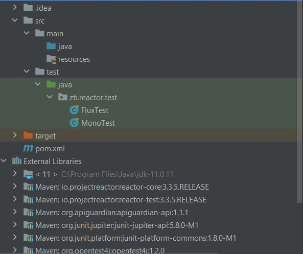
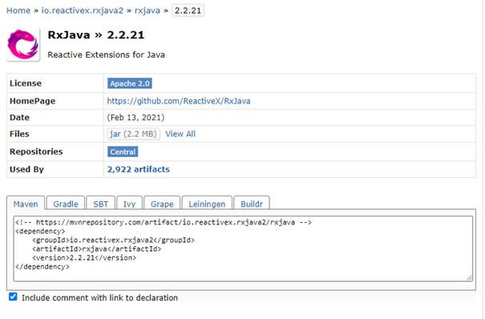
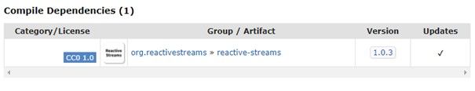
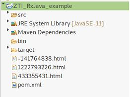
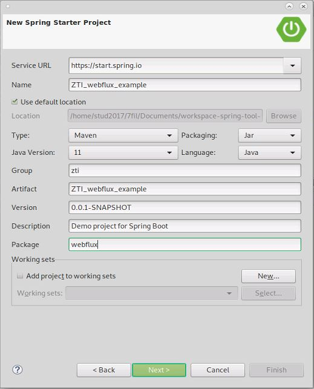
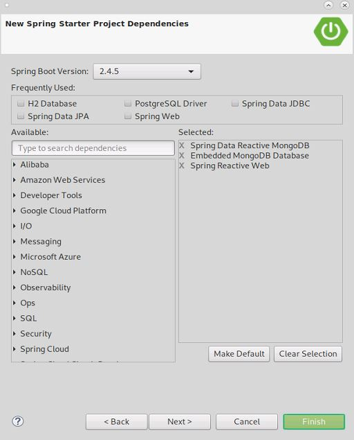
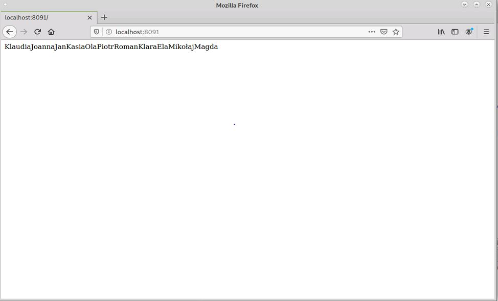

# Programowanie reaktywne

Repozytorium z przykładami i prezentacją na seminarium z przedmiotu _Zaawanoswane techonologie internetowe_ w semestrze letnim 2020/21 na Akademii Górniczo-Hutniczej w Krakowie, wydział Fizyki i Informatyki Stosowanej.

## Plan seminarium
- [Programowanie reaktywne](#programowanie-reaktywne)
  - [Plan seminarium](#plan-seminarium)
  - [Seminarium - prezentacja](#seminarium---prezentacja)
  - [Reactor Project](#reactor-project)
  - [RxJava](#rxjava)
  - [Spring Webflux](#spring-webflux)
  - [Twórcy](#twórcy)

## Seminarium - prezentacja
.
	
## Reactor Project

W tej części zaprezentowana jest konfiguracja środowiska uruchomieniowego w celu uzyskania możliwości dokonania implementacji przykładów związanych z **Project Reactor** zamieszczonych w folderze [Project Reactor](project-reactor-example).

Przedstawiona konfiguracja tworzona jest w środowisku **IntelliJ** za pomocą **Maven**.

1. Początkowo tworzymy nowy projekt **File** -> **New** -> **Project** i wybieramy **Maven** oraz w tym przypadku **Java 11**, następnie nadajemy nazwę projektu jako **project-reactor**.
2. Kolejno przechodzimy do pliku **pom.xml** w celu dodania odpowiednich zależności.
   * Modyfikujemy zawartość ```<properties>```:
    ```xml
    <properties>
        <maven.compiler.source>11</maven.compiler.source>
        <maven.compiler.target>11</maven.compiler.target>
        <reactore-core.version>3.3.5.RELEASE</reactore-core.version>
        <java.version>11</java.version>
    </properties> 
    ```
    * Oraz dodajemy zależności:
    ```xml
    <dependencies>
        <dependency>
            <groupId>io.projectreactor</groupId>
            <artifactId>reactor-core</artifactId>
            <version>${reactore-core.version}</version>
        </dependency>

        <dependency>
            <groupId>org.projectlombok</groupId>
            <artifactId>lombok</artifactId>
            <version>1.18.20</version>
        </dependency>

        <dependency>
            <groupId>org.slf4j</groupId>
            <artifactId>slf4j-api</artifactId>
            <version>1.7.30</version>
        </dependency>

        <dependency>
            <groupId>org.slf4j</groupId>
            <artifactId>slf4j-simple</artifactId>
            <version>1.7.30</version>
        </dependency>

        <!-- TEST DEPENDENCIES -->
        <dependency>
            <groupId>io.projectreactor</groupId>
            <artifactId>reactor-test</artifactId>
            <version>${reactore-core.version}</version>
        </dependency>

        <dependency>
            <groupId>org.junit.jupiter</groupId>
            <artifactId>junit-jupiter-api</artifactId>
            <version>5.8.0-M1</version>
            <scope>test</scope>
        </dependency>
    </dependencies>
    ```
3. Tworzymy pakiet **zti.reactor.test** w katalogu **src** -> **test** -> **java** i następnie tworzymy pierwszą klasę Java o nazwie **MonoTest.java**.
4. Kopiujemy poniższy kod w celu sprawdzenia konfiguracji środowiska
   ```java
    package zti.reactor.test;

    import lombok.extern.slf4j.Slf4j;
    import org.junit.jupiter.api.Test;
    import org.reactivestreams.Subscription;
    import reactor.core.publisher.Mono;

    @Slf4j
    public class MonoTest {

        @Test
        public void firstFunction(){
            log.info("Hello world!");
        }
        
        @Test
        public void monoSubscriber(){ 
            String name = "Jan Kowalski";
            Mono<String> mono = Mono.just(name)
                    .log(); 

            mono.subscribe();
            log.info("Mono {}", mono);
            log.info("Wszystko działa.");
        }
    }

   ```
5. Następnie przechodzimy do katalogu [Project Reactor](project-reactor-example) i kopiujemy umieszczony tam kod w klasie **MonoTest.java**.
6. Kolejno kopiujemy kod z klasy **FluxTest.java** i wklejamy w odpowiednie miejsce w naszym programie.
7. Struktura plików powinna wyglądać w następujący sposób:
   

## RxJava

Poniżej zaprezenowane jest uruchomienie środowiska programistycznego i jego konfiguracja, w celu zaimplementowania przykładowego projektu z użyciem **RxJava** krok po kroku:

1. Przed przystąpieniem to setup'u środowiska wymagane jest przygotowanie sobie potrzebnych bibliotek, które zostaną dołączone do projektu przy pomocy **Maven**: 
    * [RxJava](https://mvnrepository.com/artifact/io.reactivex.rxjava2/rxjava) - w poniższym przykładzie wykorzystanko najnowsza wersję [2.2.21](https://mvnrepository.com/artifact/io.reactivex.rxjava2/rxjava/2.2.21)

        
    
    * [Reactive-Stream](https://mvnrepository.com/artifact/org.reactivestreams/reactive-streams) - w dependencjach do **RxJavy 2.2.21** podana jest wersja [1.0.3](https://mvnrepository.com/artifact/org.reactivestreams/reactive-streams/1.0.3), którą też należy dołączyć do projektu

        


2. Uruchamiamy środowisko programistyczn dostępne na serwerach uczelnianych - **Eclipse**.
3. Tworzymy nowy projekt: **File -> New -> Java Project**, pozostajemy przy domyślnych ustawieniach.
4. Konwertujemy projekt do **Maven Project**: **: prawy przycisk myszy -> Configure -> Convert to Maven Project**, pozostawiając wszystkie ustawienia jako domyślne.
5. Do wygenerowanego pliku **pom.xml** dodajemy znalezione wcześniej dependencje RxJavy i ReactiveStream:
    ```xml
    <dependencies>
        <dependency>
            <groupId>io.reactivex.rxjava2</groupId>
            <artifactId>rxjava</artifactId>
            <version>2.2.21</version>
        </dependency>
        <dependency>
            <groupId>org.reactivestreams</groupId>
            <artifactId>reactive-streams</artifactId>
            <version>1.0.3</version>
        </dependency>
    </dependencies>

    ```
6. Implementujemy plik testowy **test.java**, który nie znajduje się w żadnym pakiecie:
    ```java
    import io.reactivex.Observable;
    import io.reactivex.functions.Consumer;

    public class test {

        public static void main(String[] args) {
            Observable.just("Witajcie", "na", "seminarium", "z", "Programowania reaktywnego!")
                    .subscribe(new Consumer<String>() {

                        @Override
                        public void accept(String t) throws Exception {
                            System.out.println(t);
                        }

                    });
        }
    }
    ```

7. Uruchamiamy i otrzymujemy:
    ```
    Witajcie
    na
    seminarium
    z
    Programowania reaktywnego!
    ```
    Co oznacza dobrze dodane biblioteki i pozwala przejść do głównego przykładu.


8. Aplikacja będzie przykładem programowania reaktywnego, polegająca na pobieraniu zanych stron internetowych z wykorzystaniem bibloteki **RxJava**.

9. Tworzymy nowy pakiet **rxjava**, którym umieścimy klasę **Worker.java**:
    ```java
    package rxjava;

    public class Worker {

        private static String[] url = {
                "https://github.com/ReactiveX/RxJava", 
                "http://reactivex.io/",
                "https://www.baeldung.com/rx-java"
                };
        
        public static void main(String[] args) {
            
        }
    }
    ```

10. Dodajemy do klasy **Worker.java** prostą funkcję odpowiedzialną za pobranie strony internetowej dzięki URL'owi, którą wykorzystamy przy implementacji _Observera_:
    ```java
    public static void readWebsite(String link, String filename) throws IOException {
		URL website = new URL(link);
		BufferedReader in = new BufferedReader(new InputStreamReader(website.openStream()));
		
		String inputLine;
		StringBuilder stringBuilder = new StringBuilder();	
	
		while((inputLine = in.readLine()) != null) {
			stringBuilder.append(inputLine);
			stringBuilder.append(System.lineSeparator());
		}
		
		in.close();
		
		BufferedWriter bufferedWriter = new BufferedWriter(new FileWriter(filename, false));
		bufferedWriter.write(stringBuilder.toString());
		bufferedWriter.close();
	}
    ```

11. Tworzymy w funkcji _main_ _Observera_, który jest interfacem, więc wymagana jest ]implementacja 4 metod: _onComplete()_, _onError(Throwable e)_, _onNext(String t)_ oraz dla standardu **RxJava2** _onSubscribe(Disposable d)_, które w wersji **RxJava1** nie było wymagane:
    ```java
    Observer<String> observer = new Observer<String>() {
			@Override
			public void onComplete() {
				// TODO Auto-generated method stub
			}

			@Override
			public void onError(Throwable e) { 
				// TODO Auto-generated method stub
			}

			@Override
			public void onNext(String t) {
				// TODO Auto-generated method stub
			}

			@Override
			public void onSubscribe(Disposable d) {
				// TODO Auto-generated method stub
			}
		};
    ```

12. Uzupełniamy podstawowe metody _Observera_, które będą nam potrzebne (nie przewidziałam działań dla _onError_ oraz _onSubscribe_), wprowadzamy działanie na wątkach:
    ```java
    @Override
    public void onComplete() {
        System.out.println("Wszytskie elementy zostały przetworzone!!");
    }

    @Override
    public void onNext(String t) {
        Thread thread = new Thread(new Runnable() {

            @Override
            public void run() {
                try {
                    readWebsite(t, new Random().nextInt() + ".html");
                } catch (IOException e) {
                    e.printStackTrace();
                }

            }
        });
        thread.start();

    }
    ```

13. Kiedy cała logika _Observera_ jest zaimplementowana pozostaje połączyć go z _Observable_ poprzez dodanie:
    ```java
    Observable.fromArray(url).subscribe(observer);
    ```
    do funkcji _main_.

14. Cała klasa **Worker.java** wygląda finalnie:
    ```java
    package rxjava;

    import java.io.BufferedReader;
    import java.io.BufferedWriter;
    import java.io.FileWriter;
    import java.io.IOException;
    import java.io.InputStreamReader;
    import java.net.URL;
    import java.util.Random;

    import io.reactivex.Observable;
    import io.reactivex.Observer;
    import io.reactivex.disposables.Disposable;

    public class Worker {

        private static String[] url = { 
                "https://github.com/ReactiveX/RxJava", 
                "http://reactivex.io/",
                "https://www.baeldung.com/rx-java" };

        public static void main(String[] args) {
            Observer<String> observer = new Observer<String>() {
                @Override
                public void onComplete() {
                    System.out.println("Wszytskie elementy zostały przetworzone!!");

                }

                @Override
                public void onError(Throwable e) {
                    e.printStackTrace();
                }

                @Override
                public void onNext(String t) {
                    Thread thread = new Thread(new Runnable() {

                        @Override
                        public void run() {
                            try {
                                readWebsite(t, new Random().nextInt() + ".html");
                            } catch (IOException e) {
                                e.printStackTrace();
                            }

                        }
                    });
                    thread.start();
                    System.out.println("Pobrano adres: " + t);
                }

                @Override
                public void onSubscribe(Disposable d) {

                }
            };

            Observable.fromArray(url).subscribe(observer);

        }

        public static void readWebsite(String link, String filename) throws IOException {
            URL website = new URL(link);
            BufferedReader in = new BufferedReader(new InputStreamReader(website.openStream()));

            String inputLine;
            StringBuilder stringBuilder = new StringBuilder();

            while ((inputLine = in.readLine()) != null) {
                stringBuilder.append(inputLine);
                stringBuilder.append(System.lineSeparator());
            }

            in.close();

            BufferedWriter bufferedWriter = new BufferedWriter(new FileWriter(filename, false));
            bufferedWriter.write(stringBuilder.toString());
            bufferedWriter.close();
        }

    }
    ```
    Program działa prawidłowo, wyniki wyświetlone na konsoli:
    ```java
    Pobrano adres: https: //github.com/ReactiveX/RxJava
    Pobrano adres: http: //reactivex.io/
    Pobrano adres: https: //www.baeldung.com/rx-java
    Wszytskie elementy zostały przetworzone!!
    ```
    oraz poprawnie pobrane i wygenerowane pliki w strukturze katalogu:

    

15. Inne przykłady operatorów znajdują się w katalogu _rxjava-example/src/examples_ zaczerpnięte zostały z ksiażki [Learning RxJava](http://www.blancodesigns.com.br/revistas/digital_art/imagens/Learning%20RxJava.pdf).


## Spring Webflux
Poniżej zaprezenowane jest uruchomienie środowiska programistycznego i jego konfiguracja, w celu zaimplementowania przykładowego projektu z użyciem **Spring Webflux** krok po kroku:
1. Projekt zostanie utworzony przy pomocy narzędzia **Spring Tool Suite** dostępnego na serwerach uczelnianych. Uruchamiamy go przez terminal:
    ```
    $ SpringToolSuite4 
    ```

2. Tworzymy nowy projekt w ramach tego narzędzia: **Projekt -> Spring Boot -> Spring Starter Project**, ustawiając pola następująco:
    
    

3. Dependencje jakie są potrzebne to:
    * _Spring Reactive Web_
    * _Spring Data Reactive MongoDB_
    * _Embeded MongoDB_
    
    

4. Modyfiukujemy plik **pom.xml** usuwając informacje o teście dla bazy **MongoDB**:
    ```xml
    <dependency>
        <groupId>de.flapdoodle.embed</groupId>
        <artifactId>de.flapdoodle.embed.mongo</artifactId>
	</dependency>
    <dependency>
        <groupId>io.projectreactor</groupId>
        <artifactId>reactor-test</artifactId>
    </dependency>
    ```

5. Testujemy środowisko modyfikując plik **src/test/java/webflux/ZtiWebfluxExampleApplicationTests.java**

    ```java
    package webflux;
    import org.junit.jupiter.api.Test;
    import org.springframework.boot.test.context.SpringBootTest;
    import reactor.core.publisher.Flux;
    import reactor.core.publisher.Mono;

    @SpringBootTest
    class ZtiWebfluxExampleApplicationTests {

        @Test
        void contextLoads() {
            Flux.just(  "Styczeń", "Luty", "Marzec", 
                        "Kwiecień", "Maj", "Czerwiec", 
                        "Lipiec", "Sierpień", "Wrzesień",
                        "Październik", "Listopad", "Grudzień")
                .filter(month -> month.startsWith("M"))
                .subscribe(System.out::println);
            
            
            Mono.just("Miesiąc")
                .filter(month -> month.startsWith("M"))
                .subscribe(System.out::println);
            
            Mono.just("Miesiąc")
                .filter(month -> month.startsWith("P"))
                .subscribe(System.out::println);
        }
    }
    ```
6. Przed stworzeniem aplikacji modyfikujemy plik **src/main/resources/application.properties** dodając port na którym będzie pracować nasz serwer asynchroniczny  Netty, ponieważ defaultowo włączy się na 8080, które jest zajęte przez Tomcata.
    ```
    server.port=8091
    ```

7. Tworzymy klasę **Student.java** w pakiecie **webflux**:
    ```java
    package webflux;
    import org.springframework.data.mongodb.core.mapping.Document;

    @Document
    public class Student {

        private String id;
        private String name;

        public Student() {
        }

        public Student(String name) {
            this.name = name;
        }

        public String getId() {
            return id;
        }

        public void setId(String id) {
            this.id = id;
        }

        public String getName() {
            return name;
        }

        public void setName(String name) {
            this.name = name;
        }
        
        @Override
        public String toString() {
            return "Student{" + "id='" + id + "', name='" + name + "'}";
        }
    }
    ```

8. Tworzymy klasę API dla Studenta **StudentApi.java** w pakiecie **webflux**:
    ```java
    package webflux;
    import org.springframework.web.bind.annotation.GetMapping;
    import org.springframework.web.bind.annotation.RestController;

    import reactor.core.publisher.Flux;

    @RestController
    public class StudentApi {

        @GetMapping
        public Flux<String> get() {
            return Flux.just(   "Klaudia", "Joanna", "Jan", "Kasia", "Ola", 
                                "Piotr", "Roman", "Klara", "Ela", "Mikołaj", "Magda");
        }

    }
    ```

9. Uruchamiamy projekt i sprawdzamy w przeglądarce **http://localhost:8091/**
    


10. Tworzymy interface **StudentRepo.java** w pakiecie **webflux** rozszerzający _MongoRepository_:
    ```java
    package webflux;
    import org.springframework.data.mongodb.repository.ReactiveMongoRepository;

    public interface StudentRepo extends ReactiveMongoRepository<Student, String>{

    }
    ```


11. Wracamy do **StudentApi.java**, gdzie dodajemy pole z obiektem **StudentRepo**, konstruktor i gettery i settery:
    ```java
    private StudentRepo studentRepo;

    public StudentApi(StudentRepo studentRepo) {
        this.setStudentRepo(studentRepo);
    }

    public StudentRepo getStudentRepo() {
        return studentRepo;
    }

    public void setStudentRepo(StudentRepo studentRepo) {
        this.studentRepo = studentRepo;
    }
    ```

12. Tworzymy klase **InitService.java** w pakiecie **webflux** do dodania danych do bazy, na starcie aplikacji:
    ```java
    package webflux;

    import org.springframework.stereotype.Service;

    @Service
    public class InitService {
        private StudentRepo studentRepo;

        public InitService(StudentRepo studentRepo) {
            this.setStudentRepo(studentRepo);
        }

        @EventListener(ApplicationReadyEvent.class)
        public void get() {
            studentRepo.deleteAll()
                    .thenMany(Flux.just("Klaudia", "Joanna", "Jan", "Kasia", 
                                        "Ola", "Piotr", "Roman", "Klara", 
                                        "Ela","Mikołaj", "Magda"))
                    .map(name -> new Student(name))
                    .flatMap(studentRepo::save)
                    .thenMany(studentRepo.findAll()).subscribe(System.out::println);

        }

        public StudentRepo getStudentRepo() {
            return studentRepo;
        }

        public void setStudentRepo(StudentRepo studentRepo) {
            this.studentRepo = studentRepo;
        }
    }
    ```

13. Po uzupełnieniu bazy na początku zmieniamy jedną z metod **StudentApi.java** na:
     ```java
    @GetMapping(produces = MediaType.APPLICATION_STREAM_JSON_VALUE)
        public Flux<Student> get() {
            return studentRepo.findAll().delayElements(Duration.ofSeconds(1));
        }
    ```

14. Przed sprawdzeniem w przeglądarce dodajemy do **InitService.java** dodatkową osobę spoza strumienia:
     ```java
    studentRepo.save(new Student("ANNA")).subscribe();
    ```

15. Uruchamiamy projekt i sprawdzamy w przeglądarce **http://localhost:8091/**.

16. Całość kodu znajduje się w _webflax-example_.


### Twórcy
* [Klaudia Fil](https://github.com/klaudiaf24)
* [Joanna Marcinkowska](https://github.com/jmarcinkowska)